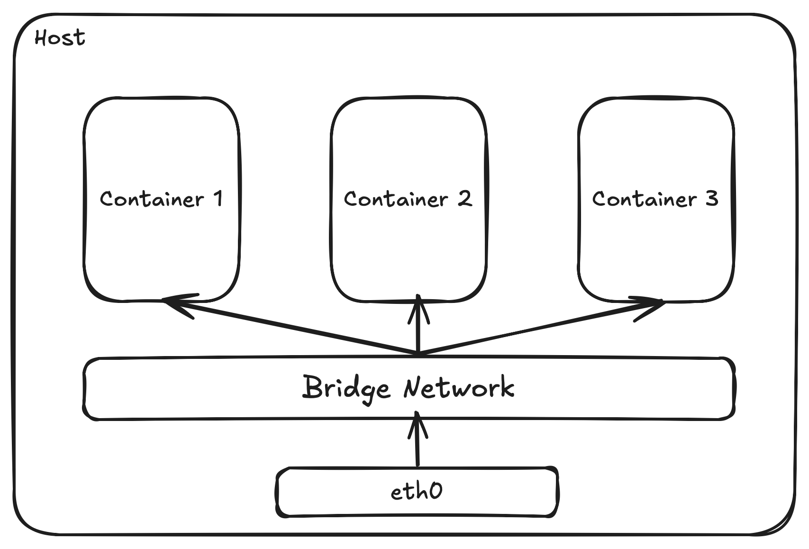
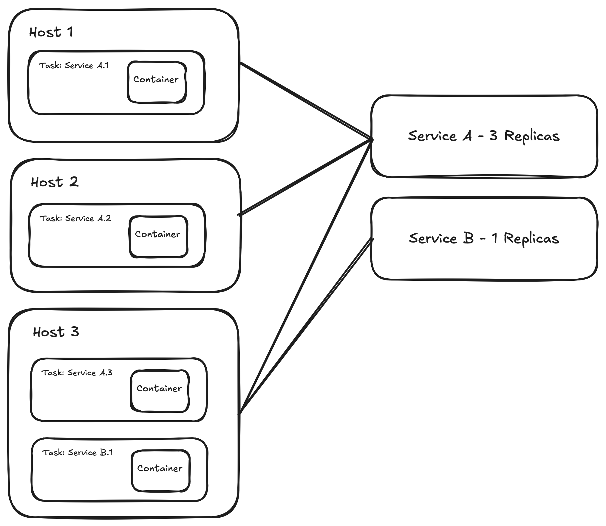
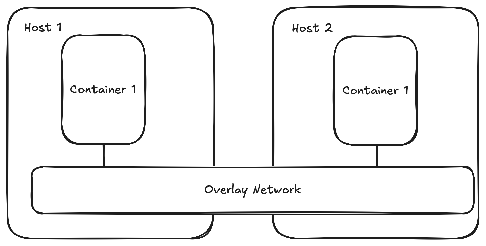
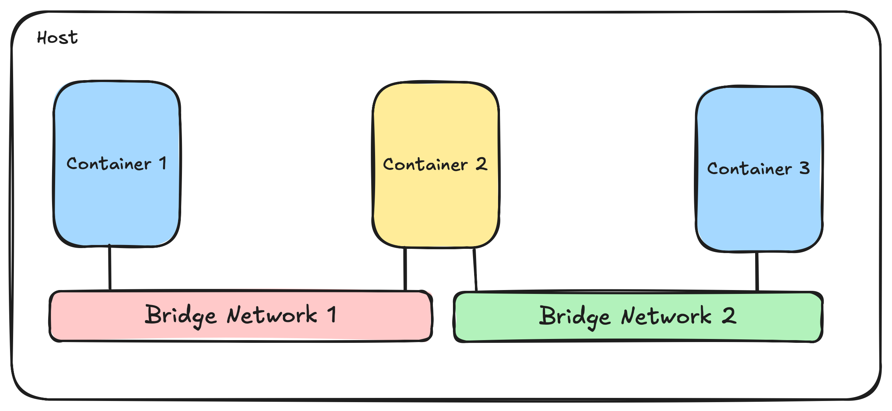

+++
title = 'Quick Docker Networking Tutorial'
date = 2024-09-19T11:56:50+02:00
+++


This tutorial focuses on two of the many networks Docker offers: Bridge and Overlay. These networks serve similar purposes in different scenarios.

## Docker Bridge Networks
In Docker, a Bridge Network is the default. If no network is specified when deploying a container, Docker assumes it will use the default bridge network. The goal of the bridge network is to allow containers to communicate while remaining isolated from the host's networks—and the outside world.



To communicate, containers connected to a bridge network can use the container's name as a hostname. This means if we deploy a container with the `--name` or `-n` flag, we can use the name as the URL instead of the container's IP address. Docker handles the DNS resolution, ensuring containers can find each other by name instead of IP.

The isolation of the network is great, but there are times when we need to access external networks or applications running inside containers. For this purpose, we can open ports in the network using the `-p` or `--publish` flag, specifying the target port we want to open as `HOST:CONTAINER`.

However, there’s a limitation we need to consider: Bridge networks are restricted to a single Docker host (like our local machine). This means that if you want to connect containers deployed on multiple machines, you'll run into challenges—this is where Docker Swarm comes in.

## Docker Swarm

Docker Swarm is Docker’s native clustering and orchestration tool, allowing you to manage a cluster of Docker engines as a single virtual system. It enables you to deploy and manage a multi-container application across multiple hosts, providing scalability, high availability, and load balancing.Within Swarm, you can define Docker services, which represent a long-running container or a group of containers that work together to perform a specific task. Services allow you to easily scale your application, manage replicas, and ensure consistent deployment across your cluster.



Now, because Docker Swarm manages multiple hosts, we need a way for containers running on different hosts to communicate with each other. This is where overlay networks come into play.

## Overlay Networks

Overlay networks solve this issue by creating a virtual network that spans across all the hosts in the Swarm. This allows containers attached to the same overlay network to communicate with each other, regardless of the physical host they’re running on.



For example, if you have a web application running on one host and a database service on another, both connected to the same overlay network, they can seamlessly communicate as if they were on the same local network.

Due to their distributed nature, we need to find new ways to communicate. With Docker Swarm, we deploy services that can have multiple instances of the same application, complicating matters further. A service in Docker is an abstraction that defines how a group of containers should run or behave. It also provides scaling, load balancing, and other features that I'll discuss in another post.

In an Overlay Network, we have two methods to communicate between containers: 
1. By using the IP addresses of the container we want to target (as we can in a bridge network).
2. By using the *service* name. For instance, suppose we have two services: one called `web-server` with 3 replicas and another called `backend-server` with 2 replicas. The `web-server` can communicate with the `backend-server` using something like `http://backend-server:<PORT>`, and Docker Swarm handles load balancing between the instances of the service.

When it comes to communicating between two different bridge networks, Docker doesn’t natively support cross-network communication because bridge networks are isolated from each other. However, there are ways to enable communication between containers on different bridge networks. Key approaches include:

1. **Container Networking**: Using a container connected to both bridge networks.
2. **Port Publishing and External Access**: Using the host network as an intermediary.
3. **Custom Network Drivers**: Utilizing advanced configurations like macvlan drivers.

Before diving into each solution, let's chat about why you might want to enable communication between containers on different networks. After all, Docker’s network model is designed for isolation, providing separate namespaces for containers to enhance security, reduce interference, and ensure predictable behavior. So, why break this isolation? Here are a few scenarios where cross-network communication might be necessary:

1. **Microservices Architecture with Legacy Systems**:  
   Microservices in different networks may need to connect with legacy systems. Cross-network communication enables integration while maintaining isolation.

2. **Complex Application Segmentation**:  
   Segmenting application components into different networks improves organization. Controlled communication ensures they still function together.

3. **Enhanced Security and Compliance**:  
   Isolating sensitive services in secure networks ensures compliance. Controlled interaction allows functionality without compromising security.

4. **Multi-Host and Hybrid Deployment**:  
   Distributed applications across multiple hosts or cloud/on-prem setups may need to connect. Bridging networks enables unified communication across environments.

5. **Service Discovery Challenges**:  
   Different stages or services in isolated networks can complicate discovery. Cross-network communication ensures access to shared resources or services.

## Container Networking

Let’s start with a solution by creating two separate bridge networks. We'll place one container on each network and use a third container connected to both networks as a communication channel or "gateway." This container will facilitate communication between the two isolated networks.



### Messaging Queues

Messaging queues are communication mechanisms used to exchange data between services, applications, or components in a decoupled and asynchronous way. Think of it like a newsletter. You have a producer—someone who publishes the newsletter—and a consumer—the person who receives it. The queue is similar to the mailing list, where the newsletter is stored until all the recipients retrieve and read it. Like with a newsletter, you can have several consumers who can receive and read the messages at different times. Each subscriber (consumer) consumes the content independently. Unlike traditional newsletters, you can also have multiple producers to the same queue.

In a messaging queue system, consumers may acknowledge receipt of messages, and the queue can ensure that messages are delivered exactly once or at least once per consumer.

For this example, we'll use [RabbitMQ](https://www.rabbitmq.com), but there are several commonly used messaging queues such as [Apache Kafka](https://kafka.apache.org), [ActiveMQ](https://activemq.apache.org), [Mosquitto](https://mosquitto.org) (similar, not really a messaging queue, but a message broker), and of course solutions by your favorite hyperscaler (AWS, Azure, and the like).

### Step 0: The Program

We'll deploy a program that sends and receives messages on a message queue. The idea is to deploy the same program on both networks and automatically send messages between the networks using the message broker. 

```python
import pika
import time
import random
import os

# Set up logging
logging.basicConfig(level=logging.INFO)

# Set up connection parameters
rabbitmq_host = os.getenv('RABBITMQ_HOST')  # RabbitMQ container name 

# Check if the RabbitMQ host is set
if not rabbitmq_host:
    logging.error("RABBITMQ_HOST environment variable is not set")
    exit(1)

connection_params = pika.ConnectionParameters(host=rabbitmq_host)

# Function to send messages
def send_message(channel, message):
    # Send a message back to the queue
    channel.basic_publish(exchange='',
                          routing_key='test_queue',
                          body=message)
    print(f" [x] Sent '{message}'")

# Function to handle received messages and send a response
def on_message_received(ch, method, properties, body):
    received_message = body.decode()
    print(f" [x] Received '{received_message}'")
    
    # Create a response message
    response_message = f"Response to '{received_message}' from {random.randint(1, 1000)}"
    
    # Simulate some processing time
    time.sleep(2)
    
    # Send the response message
    send_message(ch, response_message)

# Function to start the auto-messaging system
def start_auto_messaging(start_with_message):
    # Set up a connection and channel
    connection = pika.BlockingConnection(connection_params)
    channel = connection.channel()
    

    # Declare a queue
    channel.queue_declare(queue='test_queue')

    # Check if the system should start by sending a message
    if start_with_message:
        initial_message = f"Initial message from {random.randint(1, 1000)}"
        send_message(channel, initial_message)

    # Start consuming and handle each message with the on_message_received function
    channel.basic_consume(queue='test_queue',
                          on_message_callback=on_message_received,
                          auto_ack=True)

    print(' [*] Waiting for messages. To exit press CTRL+C')
    channel.start_consuming()

if __name__ == '__main__':
    # Read environment variable to check if the system should start by sending a message
    start_with_message = os.getenv('START_WITH_MESSAGE', 'false').lower() == 'true'
    
    # Start the auto-messaging system
    start_auto_messaging(start_with_message)
```

The application is simple: it receives two environmental variables—one to check if it should start communicating and the other with the name of the RabbitMQ container (in this case, RabbitMQ) with the messaging queue. If the application starts communicating, it sends a message with a random integer. Then, the second container will receive and send back a message composed of the message received and a new random integer.

**Note**: There's a slight bug in the app. You’ll see that the container sending the message is also able to read its own message. This can be avoided by using an app ID and setting it as a property of the message:

```python
channel.basic_publish(exchange='',
                      routing_key='test_queue',
                      body=message,
                      properties=pika.BasicProperties(
                          app_id=app_id
                    ))
```

Then you can read the message properties and choose to only process the messages where the app ID isn't the same as the application. 

I've tried to apply this, but there are some timing issues, which lead to both containers stopping sending messages. When I don't check the app ID, the timing of the messages aligns, as the second container sends two messages in a row, allowing the first container to receive a message and continue the ping-pong process of messages. If you have a solution for this problem, please feel free to reach out!

### Step 1: Setup the Networks

To start, let's create the bridge networks. Remember, you can always do the same thing using Docker Compose.

```bash
docker network create bridge-net-1
docker network create bridge-net-2
```

To check if the networks were created

 correctly, run:

```bash
docker network ls
```

The output should look something like this:

```bash
NETWORK ID     NAME           DRIVER    SCOPE
217ae951f2e2   bridge         bridge    local
ece230c416f2   bridge-net-1   bridge    local
34d8e1e02ae2   bridge-net-2   bridge    local
d068772975fd   host           host      local
8bc70472ebe1   none           null      local
```

### Step 2: Deploy Containers on Each Network

Next, we'll deploy the RabbitMQ container:

```bash
docker run -d --name rabbitmq --network bridge-net-1 --network bridge-net-2 rabbitmq
```

Once RabbitMQ is deployed and running, we can deploy the same container on each of the networks:

```bash
docker run -d --name app1 --network bridge-net-1 -e START_WITH_MESSAGE=true -e RABBITMQ_HOST=rabbitmq auto_messaging
docker run -d --name app2 --network bridge-net-2 -e START_WITH_MESSAGE=false -e RABBITMQ_HOST=rabbitmq auto_messaging
```

Once both containers are running, we can check the logs to see that the messages are being passed correctly, even if the containers are in separate networks. The RabbitMQ container, which is attached to both networks, can receive messages from both networks and pass them to the opposite network from which the message was sent.

[I've also written a Docker Compose file to make the deployment of the application simpler](https://github.com/QuietSwami/docker-network-example/blob/main/container-networking/docker-compose.yaml).

### Overlay Networks

While overlay networks span across different hosts, the same process can be used. You can create two overlay networks, attach one container to both, and use that container as a communication channel between the networks. The only difference is in network creation, where you would specify the overlay type.

```bash
docker network create -d overlay overlay-net-1
docker network create -d overlay overlay-net-2
```

If you attempt to create these networks, you might encounter the following error:

```bash
Error response from daemon: This node is not a swarm manager. Use "docker swarm init" or "docker swarm join" to connect this node to swarm and try again.
```

Overlay networks are Swarm-specific networks and can only be created by the manager of the swarm.

To test this locally, initialize a Swarm with `docker swarm init`, create the two networks, and launch the application as a stack of services.

First, deploy RabbitMQ as a service:

```bash
docker service create --name rabbitmq --network overlay-net-1 --network overlay-net-2 --replicas 1 rabbitmq:latest
```

Notice that we aren't publishing any ports, as we aren't trying to access the RabbitMQ instance from outside of both networks. Without publishing ports, only the containers connected to the network can communicate with the service.

Now, let's deploy our services:

```bash
docker service create --name app1 --network overlay-net-1 -e START_WITH_MESSAGE=true -e RABBITMQ_HOST=rabbitmq auto_messaging
docker service create --name app2 --network overlay-net-2 -e START_WITH_MESSAGE=false -e RABBITMQ_HOST=rabbitmq auto_messaging
```

Then, we can check the logs by running:

```bash
docker service logs app1
```

You should see messages coming and going from RabbitMQ between the services deployed in two different overlay networks.

## Port Publishing and External Access

In certain cases, we might need to communicate with services running outside of our networks. For this, we need to publish ports for the containers that will communicate. This opens these ports to the world—anyone who knows that the port is open can attempt to communicate with our services. This capability is essential for applications that need to be accessed by users or other systems outside of the Docker environment, such as web applications, APIs, or databases.

### How Port Publishing Works

When you publish a port, you map a port from the container to a port on the host machine. This allows traffic sent to the host's specified port to be routed to the corresponding port on the container. For instance, if you have a web application running in a container on port 80, you can expose it to the outside world by mapping it to a port on the host, such as port 8080.

```bash
docker service create \
  --name my-web-app \
  --publish published=8080,target=80 \
  my-web-app-image
```

While port publishing is a powerful feature, it also introduces security considerations:

1. **Open Ports**: When you expose a port, it becomes accessible to anyone who knows the host's IP address and the port number. It’s crucial to implement proper security measures.
2. **Secure Protocols**: Always prefer secure protocols, such as HTTPS, when exposing services to the public.
3. **Rate Limiting**: If you’re exposing a port, consider implementing throttling mechanisms to prevent abuse of your services.

Port publishing is a critical part of using Docker, even when you're working with Docker networks. Many services we want to expose require access from various locations. If you want to know more about how to use Swarm effectively, I've started a series on [Mastering Docker Swarm]({{ < ref "Mastering_Docker_Swarm_Pt._1"> }}).

## Custom Network Drivers

While Bridge and Overlay networks are great out-of-the-box, there are situations where these won't suffice. For this, Docker provides a way to build *custom network drivers*, which can be tailored to suit specific application requirements. This allows for greater flexibility in configuring networks.

The reasons for using custom drivers might differ. One clear use case is when you need support for specific, non-standard protocols (instead of HTTP, think multicast or specifying MTU sizes). Another case is when you need to integrate with existing enterprise networks, or better yet, with legacy systems.

Another good reason might be the need for enhanced performance. For high-performance applications requiring real-time data processing, a custom network driver can help you tune network parameters, leading to improvements in data transfer rates or reduced latency.

Also, by creating a custom network driver, you can incorporate advanced security features to enhance isolation and encryption of your data.

As you can see [here](https://github.com/veggiemonk/awesome-docker?tab=readme-ov-file#networking), several network drivers have already been developed that could be used in your next project. These drivers add various tools on top of the default networks, from enhanced logging and monitoring capabilities to support for more complex routing policies.

### Conclusion

Custom network drivers are an essential part of Docker networking, providing the flexibility needed to address specific challenges in modern applications. By understanding when and how to use these drivers, you can optimize container networking for performance, security, and compatibility with existing infrastructure. Whether you choose to leverage existing solutions or develop your own, custom network drivers can significantly enhance the functionality of your containerized applications.
